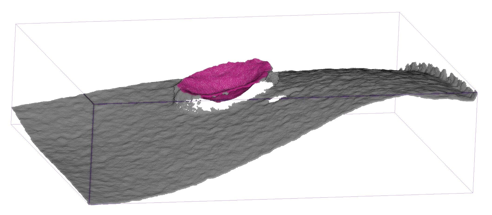

***
**   Accurate rapid 3D object detection example, with positioning accuracy below sub-millimeter and speed is 5-7ms.**
## Install:
```pip install ultralytics
pip install  torch=2.4.0  ultralytics=8.3.33
pip install open3d=1.8.0 -i https://pypi.doubanio.com/simple/
```
## Environment Request：
logcial file :  best.pt  and ultraytics  in same level directory.
## Statment：
1. if find recognition fail or error ，please return image and pointcloud to algorithm engineer.
his will send a new best.pt to you repair this question.
2. If find accuracy don't enough ,tell your algorithm engineer,he will change foucse in inner circle,current is try deeplearning accuracy.
The accuracy must be below submillimeter, for sure.
3. obsevertion pointcloud  you can install CLOUDCOMPARE.

## Instruction example：
img，depth_map  is camera  capture  return value.
## 
```
img，depth_map = acquire_image()
x_index,y_index,width,height, x,y,z=find_mark(img,depth_map)
draw_save(img,depth_map,x_index,y_index,width,height, x,y,z)
```
## Test：
python  infer.py
###  Paper Address：
《A Fourier-enhanced multi-modal 3D small object optical mark recognition and positioning method for percutaneous abdominal puncture surgical navigation》

[[arkiv paper link]](https://arxiv.org/abs/2404.08990)

                    